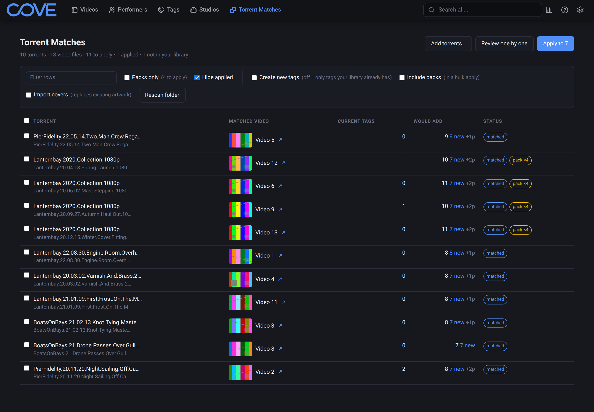
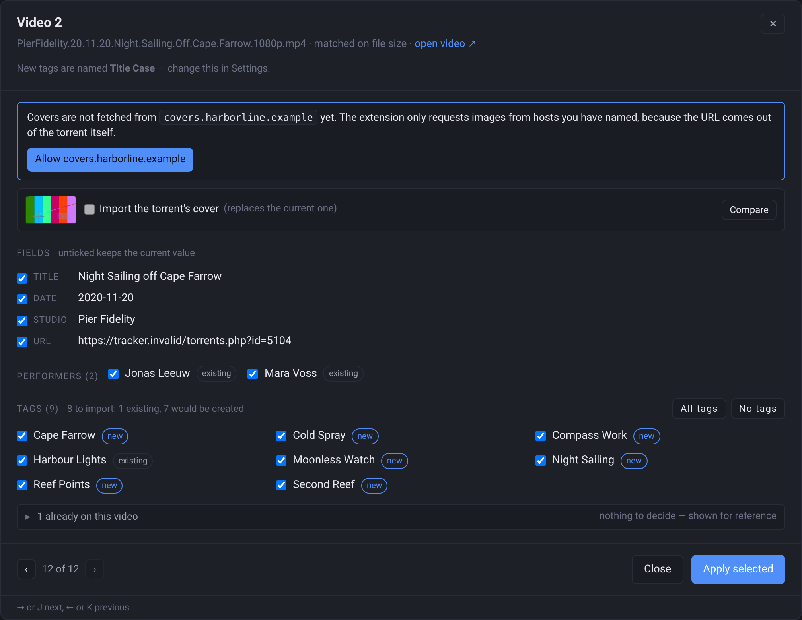
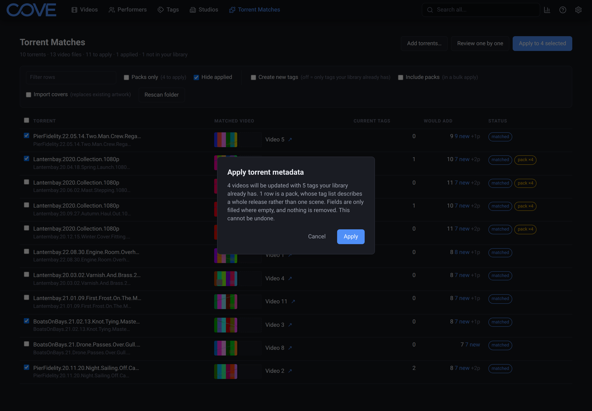
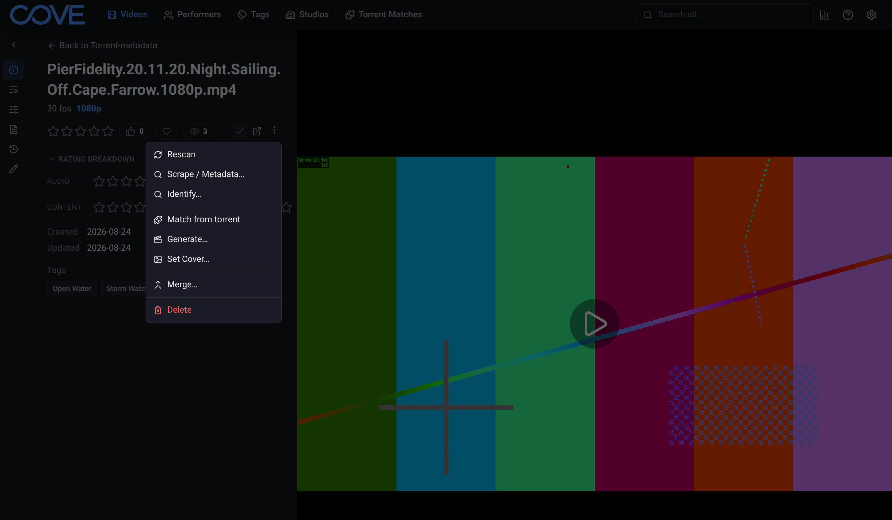
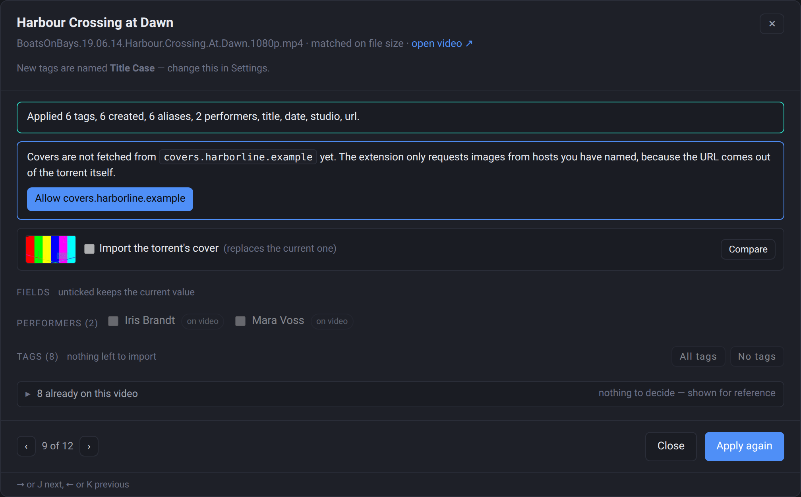
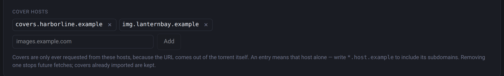

# Torrent Metadata

**Turn the metadata inside your `.torrent` files into reviewed tags, performers, studios and cover
art on the [Cove](https://github.com/yourcove/cove) videos you already have.**

Trackers built on Luminance embed a metadata block in every `.torrent` they serve — a tag list, a
title, a cover URL, a description. If your library came from those torrents, that block already
describes your videos better than anything you would type by hand. This extension reads it, matches
it to your library by exact file size, and puts every change in front of you before anything is
written.

[Releases](https://github.com/goiabos/cove-torrent-metadata/releases) ·
[Cove](https://github.com/yourcove/cove) ·
[Issues](https://github.com/goiabos/cove-torrent-metadata/issues) ·
[Contributing](CONTRIBUTING.md)

> This is a community project. It is not affiliated with, endorsed by, or supported by the Cove
> project. All titles, names and tags shown in the screenshots are invented.

## What you can do

<table>
<tr>
<td width="46%"></td>
<td>

**Review before anything is written.** Every proposal is a list of ticked rows you can untick:
tags and performers marked as already-existing or new, fields filled only where empty, the cover
shown against what is there now. A torrent is a suggestion, never an authority.

</td>
</tr>
<tr>
<td></td>
<td>

**Do a whole folder at once.** Point the extension at your torrents and every match appears on one
page — walk it row by row, or tick and bulk-apply. Packs are held back from bulk runs, because a
pack's tag list describes the whole release rather than any one scene, and the confirm dialog
tells you exactly how much a run would write before it starts.

</td>
</tr>
<tr>
<td></td>
<td>

**Or start from a single video.** *Match from torrent* on any video page opens a drop zone, and
the torrent you drop is pinned to that exact file — so the scene torrent you went and found always
wins over whatever pack happens to sit in the watched folder.

</td>
</tr>
<tr>
<td></td>
<td>

**Know exactly what an import wrote — and take it back.** Every apply reports what it did, and
every tag it wrote carries its origin and run id, so Cove can undo one run — or everything this
extension has ever done — without touching a tag you added yourself. Bulk imports stop being a
leap of faith.

</td>
</tr>
<tr>
<td></td>
<td>

**Cover art, only from hosts you name.** A cover URL arrives inside an untrusted `.torrent`, so
the allowlist ships empty and nothing is fetched until you add your tracker's image hosts. Covers
are cached, rate-limited and fetched with an honest User-Agent — your server stays a good citizen
of whatever host you point it at.

</td>
</tr>
</table>

## Install

1. Download the ZIP from the [latest release](https://github.com/goiabos/cove-torrent-metadata/releases/latest).
2. In Cove: **Settings → Extensions → Install from ZIP**.
3. Requires **Cove 1.3.1 or newer**.

**Where to find it afterwards** — three places:

- **Settings → Interface → Navigation**: toggle **Torrent Matches** on to put the batch page in
  the main menu. Cove's menu entries are opt-in, so a freshly installed extension page starts
  hidden — and while you are there, you can hide content types you don't use.
- On every **video page**, under **Operations → Match from torrent**.
- **Settings → Extensions → Torrent Metadata**: torrent folders, cover hosts, tag naming.

Then drop a `.torrent` on a video, or add a folder of torrents in settings and open **Torrent
Matches**.

## How it works

- **Matching is by exact file size**, per video file, so a pack matches each of its scenes
  independently and nothing is guessed from names.
- **Nothing is written without review.** Fields fill only where empty unless you say otherwise;
  tags and performers are only ever added.
- **Everything applied carries provenance**, so the host can purge one run, or all of it, cleanly.
- **Packs never join a bulk apply** — a whole-release tag list lands on a single scene only when
  you tick that row yourself.

## Learn more

| Doc | What's in it |
|---|---|
| [docs/USAGE.md](docs/USAGE.md) | The full behaviour: what is read, how matching and tag handling decide, cover fetching, undo, uninstall |
| [docs/BUILDING.md](docs/BUILDING.md) | Building from source, testing, packaging, and why AGPL |
| [docs/DESIGN-DECISIONS.md](docs/DESIGN-DECISIONS.md) | Why the extension is shaped this way — read before changing behaviour |
| [docs/DEV-SETUP.md](docs/DEV-SETUP.md) | Reproducing the dev environment (WSL, Docker Postgres, restored library) |
| [docs/TEST-COVERAGE.md](docs/TEST-COVERAGE.md) | Where the suite actually stands, measured rather than estimated |
| [docs/POSTGRES_LINUX_ISSUES.md](docs/POSTGRES_LINUX_ISSUES.md) | Three Linux/Docker PostgreSQL defects, with reproductions |

## Licence

**GNU AGPL v3** — see [LICENSE](LICENSE). Copyright the Torrent Metadata contributors.
Contributions are accepted under the same terms — see [CONTRIBUTING.md](CONTRIBUTING.md), and
[docs/BUILDING.md](docs/BUILDING.md) for why the licence is what it is.
